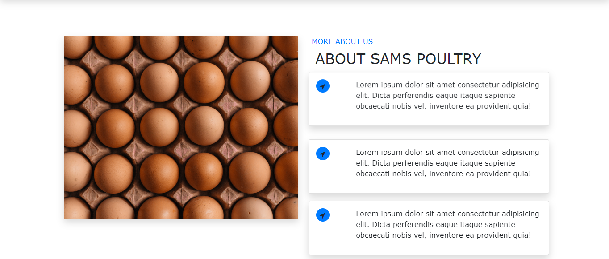
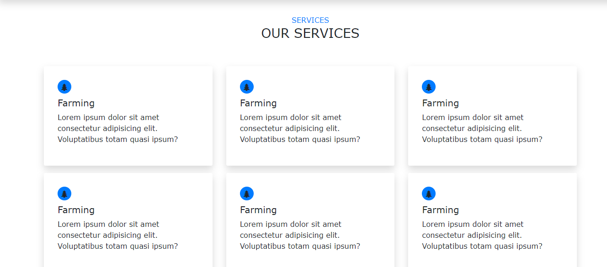
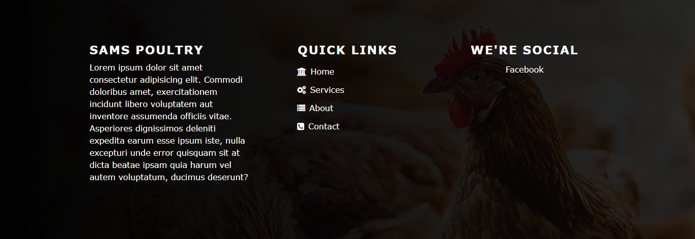

# poultryFarm_template
Its a template developed using HTML, CSS, fontawesome and Bootstrap mainly for poultry or agricultural related  projects
Bootstrap is a free and open-source CSS framework directed at responsive, mobile-first front-end web development. 
https://getbootstrap.com/
Font Awesome is a font and icon toolkit based on CSS and Less.
https://fontawesome.com/

